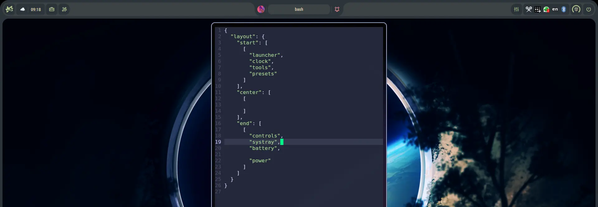
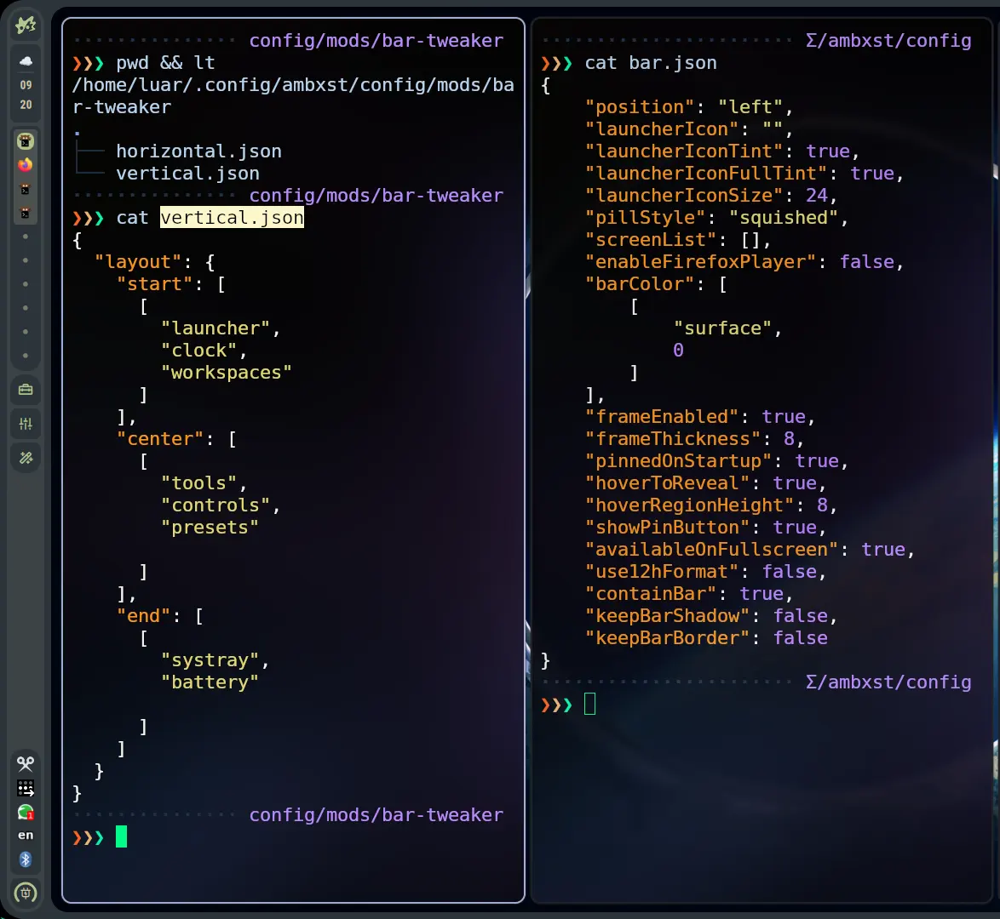

<div align="center">

# Bar Tweaker

Basically you can configure the Ambxst bar's widget layout through JSON files. 




[What it does](#what-it-does) • [Config](#config) • [Install](#install) • [How it works](#how-it-works) • [Limitations](#limitations)

</div>

---
> [!NOTE]
> I do not intend on developing a GUI for this myself but is trivial enough you can maybe make a mod for it. Or open a PR maybe.

## Install

```bash
ambxst mods install https://github.com/DeprecatedLuar/ambxst-mods/tree/main/bar-tweaker
ambxst mods enable deprecatedluar.bar-tweaker
ambxst reload
```

## What it does

Ambxst's bar layout ships hardcoded in QML: which widgets appear, in what order, and how they group into pills. Changing that layout requires editing shell source and rebuilding.

So I decided to move widget arrangement into two config files, one per bar orientation:

- `horizontal.json`: read when the bar renders on `top` or `bottom`
- `vertical.json`: read when the bar renders on `left` or `right`

Each file lists which widgets appear, in what groups, and in what order. Edits are live so you don't have to reload the bar. 
> (Some times when I keep transitioning back and forward between layouts it sometimes breaks the center anchor but idk just reload the shell. Edge case type thing)

Widget *definitions* are not touched. I explicitly decided not to touch on any other logic that goes beyond the **bar**
<div align="center">

</div>

## Config

Each orientation file defines three groups: `start`, `center`, `end`. And each group is a list of pills. Each pill is a list of widget ids.

```json
{
  "barThickness": 9,
  "layout": {
    "start":  [["launcher", "systray", "tools", "presets"]],
    "center": [["layoutSelector", "workspaces", "pin"]],
    "end":    [["controls", "battery", "clock", "power"]]
  }
}
```

- A bare string list (`["clock", "power"]`) is shorthand for a single pill.
- `barThickness` is optional, and experimental; omit it to use the vanilla bar thickness for that orientation. I don't recomment using it yet.
- Unknown widget ids are dropped, with a warning logged.
- The same id can appear more than once. You can duplicate widgets as much as you want.
- An invalid or malformed file falls back to the vanilla layout for that orientation only.
- A missing file is created with a default layout matching the vanilla arrangement.

Config location: `~/.config/ambxst/config/mods/bar-tweaker/`

### Here are all the widget ids:

`launcher`, `systray`, `tools`, `presets`, `layoutSelector`, `workspaces`, `pin`, `controls`, `battery`, `clock`, `power`

This list matches `BarWidgetMap.qml`'s registry at the time of writing. Check that file if you wanna be up to date.

## How it actually works

While looking at the source my original idea was to just replace the bar engine for a modular one that follows a standard contract for rentering.

The mod adds a rendering engine (`BarTweakerEngine.qml`) alongside vanilla's own layout code, and a small patch to `BarContent.qml` that loads the engine when a valid config is active for the current orientation. When no valid config is active, the hook falls back to vanilla's layout unchanged.

Widget position in the config determines the pill radius each widget renders with (The shell has a hardcoded value so I just made it dynamic). First in a pill gets the outer radius on its leading edge, last gets it on the trailing edge, everything between renders with the inner radius. Radius values are never stored in the config; they are derived from position each time the layout resolves.

<details>
<summary>Widget contract and load sequence</summary>

<br>

**Load sequence, per orientation:**

1. `BarContent.qml`'s hook resolves `BarTweaks.byOrientation[orientation]` and reads its `active` flag (valid JSON, has a `layout` section, integrated dock not active).
2. If `active`, the hook's `Loader` instantiates `BarTweakerEngine`, passing it `barRoot`/`barItem` (vanilla's `root`/`bar`). Vanilla's own horizontal/vertical loaders are gated off for that orientation.
3. If not `active`, the hook falls through to vanilla's layout unchanged. Nothing else in the shell is aware the mod exists.

Each orientation resolves independently. One can run the engine while the other falls back to vanilla.

**How a widget gets on the bar:**

Widget ids resolve through one id → `Component` map. Each entry is a real widget component, unmodified from vanilla. The engine doesn't know what a widget does; it only wires the connections every widget already exposes:

- Any widget that needs the bar, its screen, or a toggle handler exposes that as a plain proxy property (`barRef`, `screen`, `toggleHandler`), since a widget instantiated through this map can't reach `BarContent.qml`'s `root` directly.
- Any widget that sets its own `Layout.*` sizing internally (fill width/height, preferred size) needs that re-declared on its wrapping `Loader`, because `Layout.*` attached properties go inert once the widget becomes a grandchild via `Loader` instead of a direct layout child. The engine does this per-widget through dispatch tables keyed on widget id, rather than hardcoding exceptions inline.
- Pill radius (`startRadius`/`endRadius`) is pushed into each widget from its resolved position in the config, per the derivation rule above. This is the only value the engine computes rather than forwards.

Adding a new widget to the bar means adding it to the id → `Component` map. Adding a widget whose sizing or wiring diverges from the common case (reads real `parent` geometry, needs an id-specific default before the engine's own binding lands) means adding it to the matching dispatch table instead of branching inline in the engine.

</details>

## Limitations

- Bar position (`top`/`bottom`/`left`/`right`) is controlled by vanilla `bar.json`, not by this mod. Bar Tweaker only controls what renders inside the bar, not where the bar sits.
- When the integrated dock theme is active, this mod has no effect; the bar always renders vanilla's layout in that state. (This was a deliberate choice not to go beyond bar logic otherwise I'd have to play around with dock's rendering code to turn into a widget).
- Compatible with Ambxst `>=1.3.0 <1.4.0`. Tested against upstream commit `af9f8ad`, so idk have the latest version I guess.

## Plans I have for the future

- Click listeners on the bar: right click, scroll, and so on.
- Proper bar thickness control (the current `barThickness` option is experimental, see [Config](#config)).
- Multiple bars.
- Collapse the dock, the notch, and the tool bar into the same contract as the bar, so everything is a bar running the same engine and any widget can be placed on any of them. This one probably needs upstream changes.

### Have fun with it

## License

MIT
